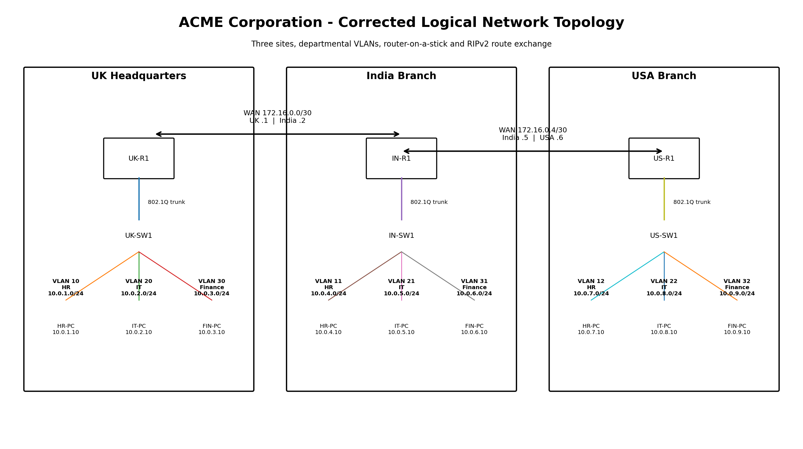
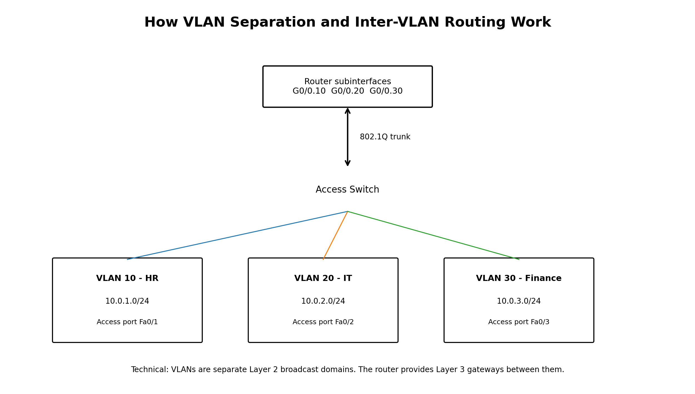
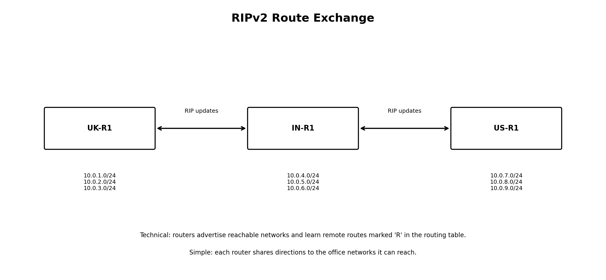
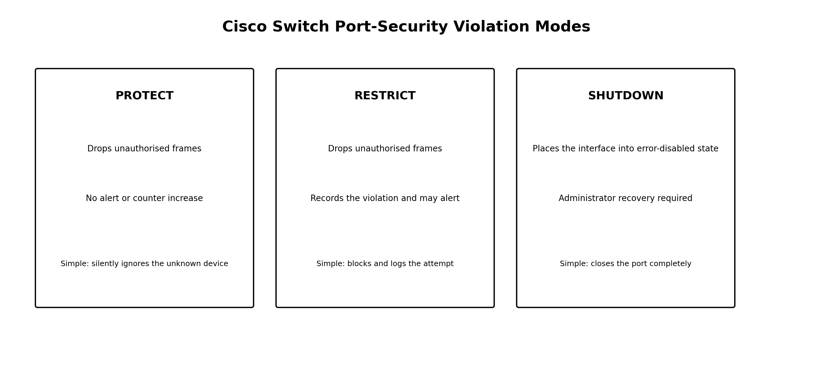

# ACME Corporation Secure Network Design Lab

A cleaned and internally consistent reconstruction of a university networking project, designed for a GitHub portfolio.

The network connects three ACME Corporation offices in the UK, India and USA. Each site separates HR, IT and Finance with VLANs, uses router-on-a-stick for inter-VLAN routing, exchanges routes through RIPv2 and applies basic switch and device security.

> **Evidence note:** the diagrams and terminal-style images in this repository were generated from the corrected design. They are explanatory portfolio assets, not authentic Cisco Packet Tracer screenshots. Real captures can replace them after the `.pkt` file is recreated or uploaded.

## Project Summary

### Technical explanation

The design uses a `10.0.0.0/20` private IPv4 block divided into nine `/24` departmental subnets. Two `/30` networks connect the routers. Departmental VLANs create separate Layer 2 broadcast domains, and router subinterfaces provide the default gateways. RIPv2 advertises the site networks across the WAN.

### Simple explanation

Each country has its own office network. HR, IT and Finance are placed into separate sections so their traffic stays organised. Routers connect the offices and share directions so computers in different countries can communicate.



## Main Features

| Feature | Technical explanation | Simple explanation |
|---|---|---|
| FLSM subnetting | Equal `/24` subnets are allocated from `10.0.0.0/20`; `/30` networks are used for WAN links. | The address space is divided into predictable blocks for each department and small links between routers. |
| VLANs | Each department is placed into its own Layer 2 broadcast domain. | HR, IT and Finance are separated even though they share a physical switch. |
| Router-on-a-stick | 802.1Q subinterfaces route between VLANs over one trunk link. | One router connection acts as a controlled doorway between departments. |
| RIPv2 | Routers exchange reachable network information and install remote routes. | Routers share directions to the other offices. |
| Port security | Sticky MAC learning and violation modes restrict unauthorised devices. | A switch port can remember the approved device and block an unexpected one. |
| ICMP testing | Ping and route inspection verify end-to-end Layer 3 reachability. | Test messages confirm that devices can reach each other. |
| Device hardening | Hostnames, secrets, SSH-only management and shutdown of unused ports reduce exposure. | Basic security settings make devices safer and easier to administer. |

## Addressing Plan

| Site | Department | VLAN | Network | Gateway | Example PC |
|---|---|---:|---|---|---|
| UK | HR | 10 | `10.0.1.0/24` | `10.0.1.1` | `10.0.1.10` |
| UK | IT | 20 | `10.0.2.0/24` | `10.0.2.1` | `10.0.2.10` |
| UK | Finance | 30 | `10.0.3.0/24` | `10.0.3.1` | `10.0.3.10` |
| India | HR | 11 | `10.0.4.0/24` | `10.0.4.1` | `10.0.4.10` |
| India | IT | 21 | `10.0.5.0/24` | `10.0.5.1` | `10.0.5.10` |
| India | Finance | 31 | `10.0.6.0/24` | `10.0.6.1` | `10.0.6.10` |
| USA | HR | 12 | `10.0.7.0/24` | `10.0.7.1` | `10.0.7.10` |
| USA | IT | 22 | `10.0.8.0/24` | `10.0.8.1` | `10.0.8.10` |
| USA | Finance | 32 | `10.0.9.0/24` | `10.0.9.1` | `10.0.9.10` |

WAN links:

- UK to India: `172.16.0.0/30`
- India to USA: `172.16.0.4/30`

## Repository Contents

```text
secure-network-design-lab/
├── README.md
├── ROADMAP.md
├── assets/
│   ├── diagrams/
│   └── illustrative-outputs/
├── configurations/
├── docs/
└── packet-tracer/
```

## Visual Walkthrough

### VLAN and Inter-VLAN Routing



### Route Exchange



### Port Security



### ICMP Packet Flow


## Documentation

- [Technical and simple explanations](docs/TECHNICAL-WALKTHROUGH.md)
- [Addressing and VLAN plan](docs/ADDRESSING-AND-VLANS.md)
- [Routing and testing](docs/ROUTING-AND-TESTING.md)
- [Security controls](docs/SECURITY-CONTROLS.md)
- [Corrections made from the original report](docs/RECONSTRUCTION-NOTES.md)
- [Roadmap](ROADMAP.md)

## Skills Demonstrated

- IPv4 subnetting
- VLAN design
- Router-on-a-stick
- Dynamic routing with RIPv2
- Cisco IOS configuration
- Switch port security
- Connectivity testing
- Troubleshooting
- Security recommendations
- Technical documentation
- Independent project ownership

## Author

**Aakif Ahmed**  
Computer Science undergraduate focused on cybersecurity, AI, automation and secure systems.
