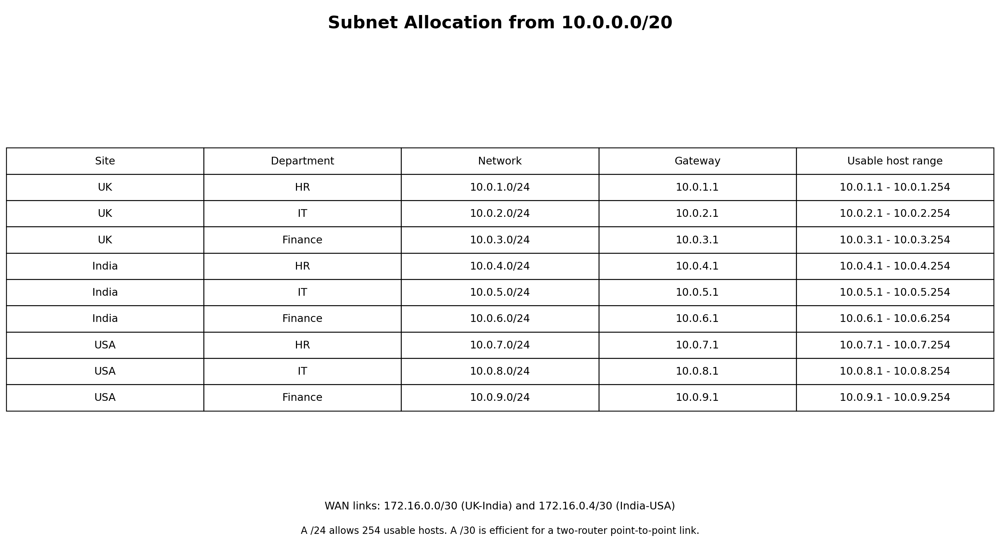
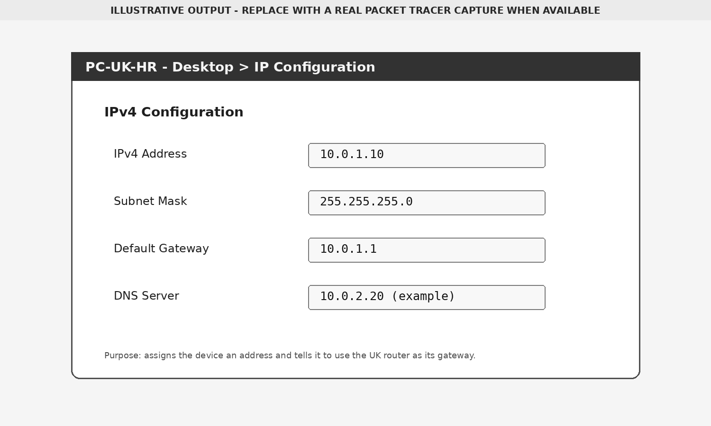

# Addressing and VLAN Plan

## Departmental Networks

The `10.0.0.0/20` block can contain sixteen `/24` networks. Nine are used for the departments and the remaining space is available for future growth.

## VLAN Allocation

| Site | HR | IT | Finance |
|---|---:|---:|---:|
| UK | 10 | 20 | 30 |
| India | 11 | 21 | 31 |
| USA | 12 | 22 | 32 |

Using unique site-specific VLAN IDs makes screenshots and troubleshooting easier to interpret.

## Trunking

The switch port facing the router operates as an 802.1Q trunk. It carries all three site VLANs to matching router subinterfaces.

## Host Configuration

An end device needs:

- An address from its VLAN subnet
- The `/24` subnet mask
- The matching router subinterface as its default gateway

The image above is generated from the design and should be replaced by an authentic Packet Tracer capture when the final `.pkt` file is available.
