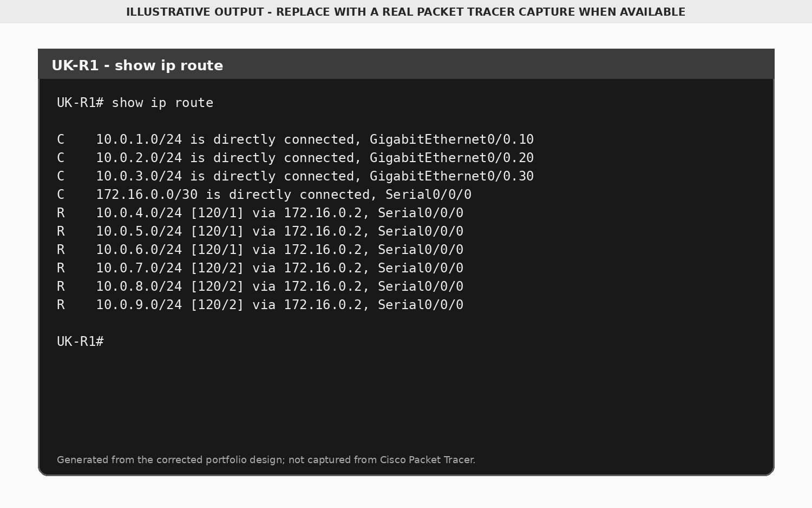
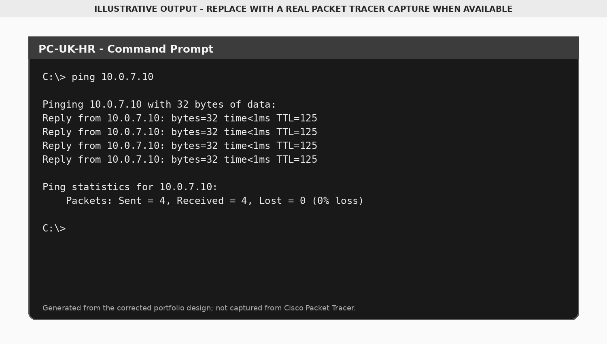
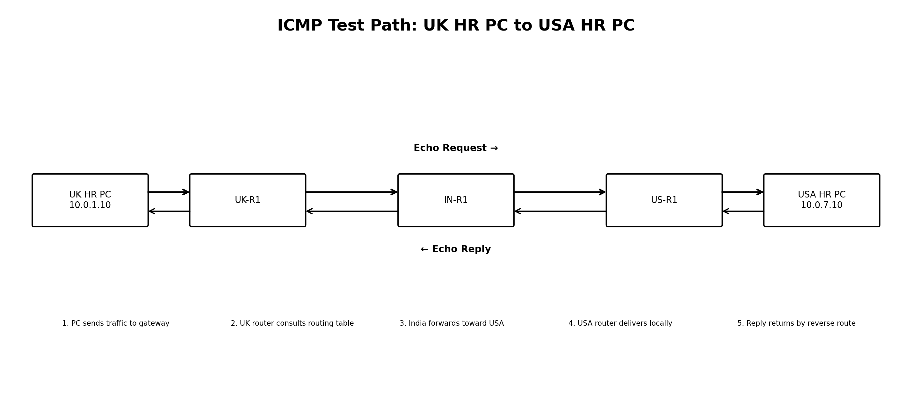
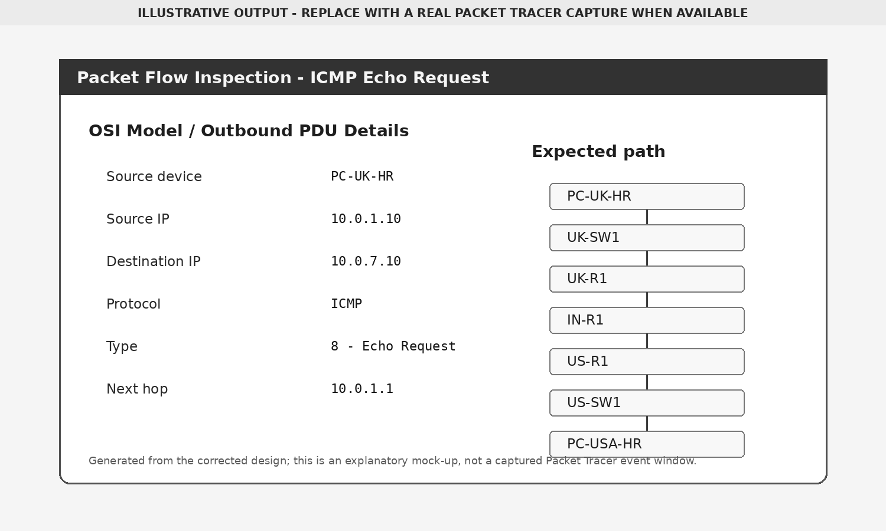

# Routing and Testing

## RIPv2 Configuration

Each router advertises its directly connected `10.0.0.0` and `172.16.0.0` networks.

The portfolio reconstruction uses:

```text
router rip
 version 2
 no auto-summary
 network 10.0.0.0
 network 172.16.0.0
```

The original report used `network 172.16.0.4` on the USA router. The corrected configuration uses the classful network statement `network 172.16.0.0`.

## Route Verification



Connected networks appear with `C`. Networks learned through RIP appear with `R`.

## Ping Testing



A complete validation plan should test:

1. A PC to its local gateway
2. Devices in different VLANs at the same site
3. UK to India
4. UK to USA
5. India to USA
6. Expected blocked traffic after ACLs or firewalls are introduced

## Packet Flow




