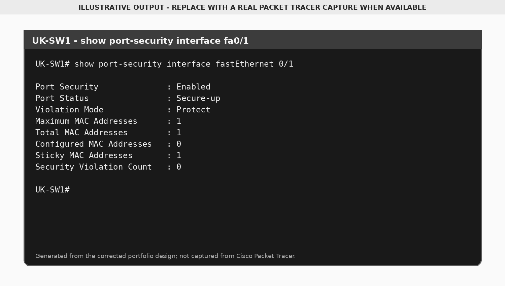
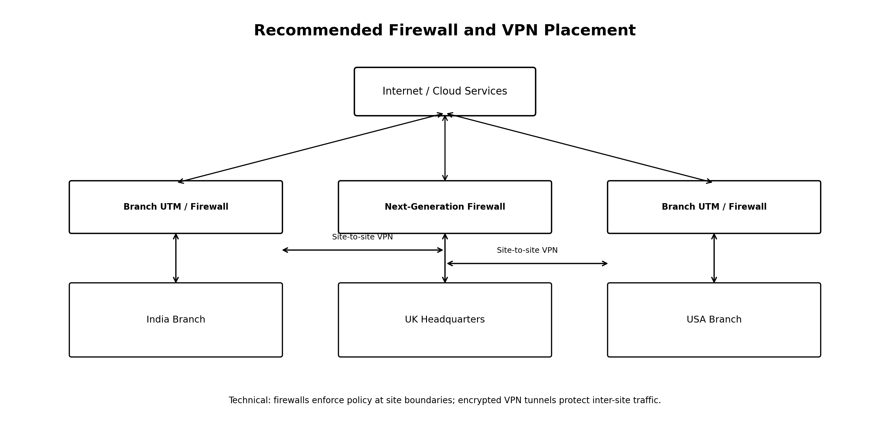

# Security Controls

## VLAN Separation

VLANs reduce unnecessary broadcast traffic and create boundaries between departments. VLANs alone are not a complete security policy; access-control lists or firewalls are needed to decide which inter-VLAN traffic is allowed.

## Port Security

The reconstructed design applies:

- UK HR port: protect
- India HR port: restrict
- USA HR port: shutdown

## Management Security

The reference configurations include:

- Descriptive hostnames
- `enable secret`
- Local login controls
- SSH-only VTY access
- MOTD warning banner
- Disabled DNS lookup
- Shutdown of unused switch ports

Credentials are redacted in the public files.

## Firewall and VPN Recommendation

A realistic deployment would place a higher-capacity next-generation firewall at the UK headquarters and smaller branch firewalls at India and USA. Site-to-site VPNs would encrypt traffic crossing untrusted networks.
